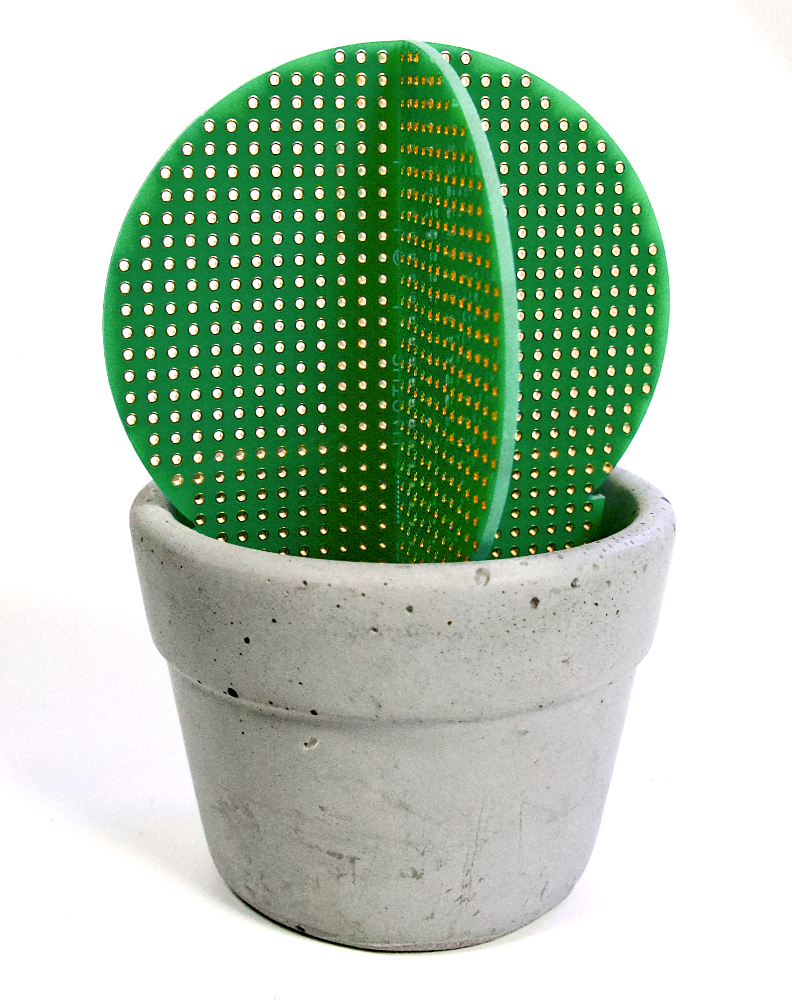

# Hactus

<figure><figcaption>
The Hactus on a white background
</figcaption></figure>

### The Hacker's Cactus

The Hactus is a manufacturable art piece by Chloe Madison (@clomads) that embodies the visual of a cactus succulent using two interlocking PCB 'perfboards.' It also includes a mateable flower pot intended for casting in concrete.

### Links to source

PCB Layout [https://easyeda.com/clomads/hacker-cactus](https://easyeda.com/clomads/hacker-cactus)

3D Model in Fusion360 - for flower pot, mold box, and basis of PCB (not actual board specs) [https://a360.co/2oIjCiu](https://a360.co/2oIjCiu)
